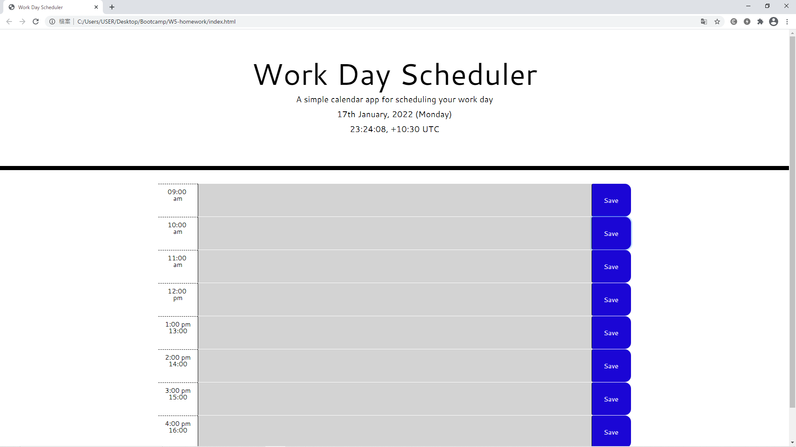

# Working-hour-Scheduler

## Deploy link
https://aurorachama.github.io/Working-hour-Scheduler/
## Purpose
The purpose of this webpage is to create a Day (Working hour) Scheduler for users to save hourly event happens at a daily basis.

## User Guide
* User would be shown a empty webpage (scheduler) and a clock upon entering the webpage
```
The clock is updated every second, using setInterval inside JavaScript
```
* Users can then name the item each row (inside the text area next to the time description)

* The button **Save** is the interaction for an user to save to desire item

* Upon pressing the **Save** button, the input would be saved **locally** via JavaScript and an prompt will pop up displaying the input and as a confirmation
```
Item to do: <input> is added.
```
## Stored Item
* The stored item would not disappear after page refreshes, and would be automatically loaded every time the page refreshes.

## Third-party API used
* JQuery <br>
https://jquery.com/
* Bootstrap <br>
https://getbootstrap.com/
* Google Fonts <br>
https://fonts.google.com/
* Moment.js <br>
https://momentjs.com/

## Screenshot

